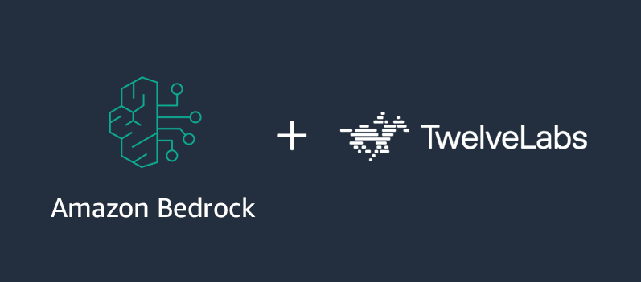

# TwelveLabs on Amazon Bedrock: A-to-Z Workshop

> **Disclaimer:** This workshop is provided for educational and informational purposes only. The sample code and configurations are not intended for production use. Please review and adapt them according to your organization's security and compliance requirements. AWS service charges may apply for resources created during this workshop. Video content used in this workshop is sourced from publicly available materials and is attributed where applicable.

<p align="center">
  
</p>

These hands-on workshops introduce how to use [TwelveLabs models on Amazon Bedrock](https://aws.amazon.com/bedrock/twelvelabs/). Starting from basic API usage to advanced multi-vector embedding strategies, each module progressively builds on the previous one to provide a comprehensive understanding of TwelveLabs' video understanding capabilities within the Bedrock ecosystem.

Check the [Bedrock documentation](https://docs.aws.amazon.com/bedrock/latest/userguide/models-regions.html) for the latest list of supported regions for each model. Learn more about the integration on the [TwelveLabs documentation](https://docs.twelvelabs.io/v1.3/docs/cloud-partner-integrations/amazon-bedrock).

## Workshop Modules

### Module 1: Basic — TwelveLabs on Bedrock Fundamentals

Learn the basics of TwelveLabs Pegasus and Marengo models. Experience the end-to-end flow of Bedrock-based video AI, from video analysis and text embedding generation to semantic search with OpenSearch.

| Notebook | Description |
|----------|-------------|
| [twelvelabs-bedrock-workshop.ipynb](1_basic/twelvelabs-bedrock-workshop.ipynb) | Pegasus video analysis & Marengo embedding + OpenSearch search |

### Module 2: Strands — Multi-Agent Video System

Build a multi-agent system using the Agent as Tool pattern with the Strands Agents framework. Specialized agents handle embedding creation, video search, summarization, and transcript processing, coordinated by an orchestrator agent.

| Notebook | Description |
|----------|-------------|
| [video_agent.ipynb](2_strands/video_agent.ipynb) | Agent as Tool pattern — Embedding, Search, Summary, Transcript agents |

### Module 3: Marengo Embedding Strategy — Multi-Vector Retrieval

Compare retrieval strategies step by step using Marengo 3.0's visual, audio, and transcription multi-vector embeddings. Perform ANN search with S3 Vectors, progressing from the limitations of fixed weights to intent-based dynamic routing.

| Notebook | Description |
|----------|-------------|
| [01_setup_and_embedding.ipynb](3_marengo_embedding_strategy/01_setup_and_embedding.ipynb) | Video upload, multi-vector embedding generation, and S3 Vectors storage |
| [02_fused_embeddings.ipynb](3_marengo_embedding_strategy/02_fused_embeddings.ipynb) | Approach 1: Fused Embedding — baseline approach merging 3 modalities into one, and its limitations |
| [03_multivector_fixed_weights.ipynb](3_marengo_embedding_strategy/03_multivector_fixed_weights.ipynb) | Approach 2: Multi-Vector with Fixed Weights — Score-based Fusion vs. RRF comparison |
| [04_intent_based_routing.ipynb](3_marengo_embedding_strategy/04_intent_based_routing.ipynb) | Approach 3: Intent-based Dynamic Routing — per-query dynamic weights via anchor similarity |

**Module 3 learning progression:**

```
02 Fused:    Merged at storage time, fixed weights, irreversible  → Identify limitations
03 Fixed:    Merged at query time, fixed weights, reversible      → Debuggable but still fixed
04 Dynamic:  Merged at query time, auto weights, reversible       → Adapts to query intent
```

## Getting Started

### Prerequisites

- AWS account with [AWS credentials configured](https://boto3.amazonaws.com/v1/documentation/api/latest/guide/credentials.html)
- [TwelveLabs model access enabled in Amazon Bedrock](https://docs.aws.amazon.com/bedrock/latest/userguide/model-access.html)
- [Jupyter environment](https://jupyter.org/install) (JupyterLab, SageMaker Studio, etc.)
- Python 3.9+

### AWS Services Used

| Service | Usage |
|---------|-------|
| Amazon Bedrock | TwelveLabs Pegasus (video analysis), Marengo (embedding generation) |
| Amazon S3 | Video file storage, embedding output storage |
| Amazon S3 Vectors | ANN vector search (Module 3) |
| Amazon OpenSearch Serverless | Semantic search (Module 1) |
| Amazon DynamoDB | Task state management (Module 2) |
| Amazon Transcribe | Video transcript generation (Module 2) |

### Setup

**Step 1: Clone this repo**

```bash
git clone https://github.com/aws-samples/sample-twevelabs-a-z.git
cd sample-twevelabs-a-z
```

**Step 2: Install dependencies**

```bash
pip install boto3 numpy opensearch-py pandas scikit-learn strands-agents
```

**Step 3: Run notebooks**

Run the notebooks in each module directory in order. Follow the instructions within each notebook to update required variables such as S3 bucket names.

## Resources

- [AWS Launch Announcement](https://aws.amazon.com/about-aws/whats-new/2025/07/twelvelabs-models-fully-managed-amazon-bedrock/)
- [AWS Docs: TwelveLabs on Amazon Bedrock](https://docs.aws.amazon.com/bedrock/latest/userguide/model-parameters-twelvelabs.html)
- [AWS Blog: TwelveLabs video understanding models are now available in Amazon Bedrock](https://aws.amazon.com/blogs/aws/twelvelabs-video-understanding-models-are-now-available-in-amazon-bedrock/)
- [TwelveLabs Documentation](https://docs.twelvelabs.io/v1.3/docs/cloud-partner-integrations/amazon-bedrock)
- [Strands Agents Framework](https://github.com/strands-agents/sdk-python)

---

# TwelveLabs on Amazon Bedrock: A-to-Z Workshop (Korean)

> **면책 조항:** 이 워크샵은 교육 및 정보 제공 목적으로만 제공됩니다. 샘플 코드와 구성은 프로덕션 용도가 아닙니다. 조직의 보안 및 규정 준수 요구사항에 맞게 검토하고 조정하세요. 이 워크샵에서 생성하는 리소스에 대해 AWS 서비스 요금이 발생할 수 있습니다. 워크샵에서 사용하는 비디오 콘텐츠는 공개적으로 이용 가능한 자료에서 가져온 것이며, 해당하는 경우 출처를 명시합니다.

<p align="center">
  
</p>

이 핸즈온 워크샵은 [Amazon Bedrock에서 TwelveLabs 모델](https://aws.amazon.com/bedrock/twelvelabs/)을 사용하는 방법을 소개합니다. 기본 API 사용법부터 고급 멀티벡터 임베딩 전략까지, 각 모듈이 이전 모듈을 기반으로 점진적으로 구성되어 Bedrock 생태계 내에서 TwelveLabs의 비디오 이해 기능을 종합적으로 학습할 수 있습니다.

각 모델의 최신 지원 리전 목록은 [Bedrock 문서](https://docs.aws.amazon.com/bedrock/latest/userguide/models-regions.html)를 확인하세요. 연동에 대한 자세한 내용은 [TwelveLabs 문서](https://docs.twelvelabs.io/v1.3/docs/cloud-partner-integrations/amazon-bedrock)에서 확인할 수 있습니다.

## 워크샵 모듈

### 모듈 1: Basic — TwelveLabs on Bedrock 기초

TwelveLabs Pegasus와 Marengo 모델의 기본 사용법을 학습합니다. 비디오 분석, 텍스트 임베딩 생성, OpenSearch를 활용한 시맨틱 검색까지 Bedrock 기반 비디오 AI의 전체 흐름을 경험합니다.

| 노트북 | 설명 |
|--------|------|
| [twelvelabs-bedrock-workshop.ipynb](1_basic/twelvelabs-bedrock-workshop.ipynb) | Pegasus 비디오 분석 & Marengo 임베딩 + OpenSearch 검색 |

### 모듈 2: Strands — 멀티에이전트 비디오 시스템

Strands Agents 프레임워크를 활용하여 Agent as Tool 패턴의 멀티에이전트 시스템을 구축합니다. 임베딩 생성, 비디오 검색, 요약, 자막 처리를 전문 에이전트가 분담하고 오케스트레이터가 조율합니다.

| 노트북 | 설명 |
|--------|------|
| [video_agent.ipynb](2_strands/video_agent.ipynb) | Agent as Tool 패턴 — Embedding, Search, Summary, Transcript 에이전트 |

### 모듈 3: Marengo Embedding Strategy — 멀티벡터 검색

Marengo 3.0의 visual, audio, transcription 멀티벡터 임베딩을 활용한 검색 전략을 단계별로 비교합니다. S3 Vectors를 사용하여 ANN 검색을 수행하며, 고정 가중치의 한계에서 쿼리 의도 기반 동적 라우팅까지 발전시킵니다.

| 노트북 | 설명 |
|--------|------|
| [01_setup_and_embedding.ipynb](3_marengo_embedding_strategy/01_setup_and_embedding.ipynb) | 비디오 업로드 및 멀티벡터 임베딩 생성, S3 Vectors 저장 |
| [02_fused_embeddings.ipynb](3_marengo_embedding_strategy/02_fused_embeddings.ipynb) | 접근법 1: Fused Embedding — 3개 모달리티를 하나로 합치는 기본 접근법과 한계 확인 |
| [03_multivector_fixed_weights.ipynb](3_marengo_embedding_strategy/03_multivector_fixed_weights.ipynb) | 접근법 2: Multi-Vector with Fixed Weights — Score-based Fusion과 RRF 비교 |
| [04_intent_based_routing.ipynb](3_marengo_embedding_strategy/04_intent_based_routing.ipynb) | 접근법 3: Intent-based Dynamic Routing — 앵커 유사도 기반 쿼리별 동적 가중치 |

**모듈 3 학습 흐름:**

```
02 Fused:    저장 시 합침, 가중치 고정, 비가역     → 한계 확인
03 Fixed:    검색 시 합침, 가중치 고정, 가역적     → 디버깅 가능하나 여전히 고정
04 Dynamic:  검색 시 합침, 가중치 자동, 가역적     → 쿼리 의도에 적응
```

## 시작하기

### 사전 요구사항

- AWS 계정 및 [AWS credentials 설정](https://boto3.amazonaws.com/v1/documentation/api/latest/guide/credentials.html)
- [Amazon Bedrock에서 TwelveLabs 모델 액세스 활성화](https://docs.aws.amazon.com/bedrock/latest/userguide/model-access.html)
- [Jupyter 환경](https://jupyter.org/install) (JupyterLab, SageMaker Studio 등)
- Python 3.9+

### 사용하는 AWS 서비스

| 서비스 | 용도 |
|--------|------|
| Amazon Bedrock | TwelveLabs Pegasus (비디오 분석), Marengo (임베딩 생성) |
| Amazon S3 | 비디오 파일 저장, 임베딩 결과 저장 |
| Amazon S3 Vectors | ANN 벡터 검색 (모듈 3) |
| Amazon OpenSearch Serverless | 시맨틱 검색 (모듈 1) |
| Amazon DynamoDB | 작업 상태 관리 (모듈 2) |
| Amazon Transcribe | 비디오 자막 생성 (모듈 2) |

### 설정

**Step 1: 리포지토리 클론**

```bash
git clone https://github.com/aws-samples/sample-twevelabs-a-z.git
cd sample-twevelabs-a-z
```

**Step 2: 의존성 설치**

```bash
pip install boto3 numpy opensearch-py pandas scikit-learn strands-agents
```

**Step 3: 노트북 실행**

각 모듈 디렉토리의 노트북을 순서대로 실행합니다. 노트북 내 안내에 따라 S3 버킷 이름 등 필요한 변수를 업데이트하세요.

## 참고 자료

- [AWS 출시 공지](https://aws.amazon.com/about-aws/whats-new/2025/07/twelvelabs-models-fully-managed-amazon-bedrock/)
- [AWS 문서: TwelveLabs on Amazon Bedrock](https://docs.aws.amazon.com/bedrock/latest/userguide/model-parameters-twelvelabs.html)
- [AWS 블로그: TwelveLabs video understanding models are now available in Amazon Bedrock](https://aws.amazon.com/blogs/aws/twelvelabs-video-understanding-models-are-now-available-in-amazon-bedrock/)
- [TwelveLabs 문서](https://docs.twelvelabs.io/v1.3/docs/cloud-partner-integrations/amazon-bedrock)
- [Strands Agents 프레임워크](https://github.com/strands-agents/sdk-python)
